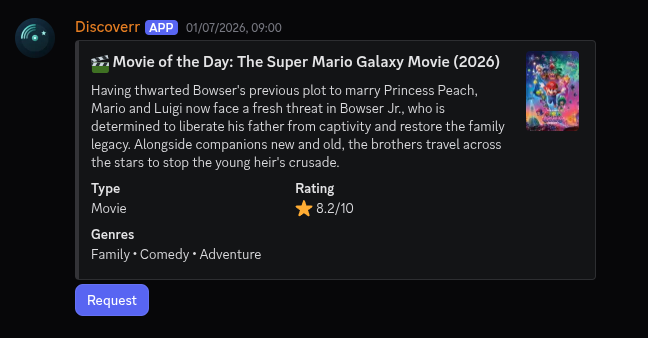
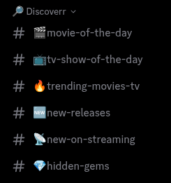

# Discoverr.

<p align="center">
  
</p>

<p align="center">
  <strong>Daily media recommendations in Discord, with Seerr request buttons</strong><br/>
  TypeScript · TMDb · Seerr · Jellyfin · Docker · ARR companion
</p>

<p align="center">
  <a href="https://github.com/loafdaddy/discoverr-bot/releases/tag/v2.1.0">v2.1.0</a>
  ·
  <a href="SETUP.md">Setup</a>
  ·
  <a href="docs/RELEASES.md">Releases</a>
  ·
  <a href="CONTRIBUTING.md">Contributing</a>
  ·
  <a href="docs/README.md">Docs index</a>
</p>

Discoverr is a lightweight Discord bot for Seerr and Jellyfin users. It posts scheduled movie and TV picks into dedicated channels and lets people request titles through Seerr without leaving Discord.

Built to sit beside an ARR-style stack — Sonarr, Radarr, and friends — as a small Docker companion.

<p align="center">
  
</p>

## What it does

- **Movie / TV of the Day**, **Trending**, **New releases**, **Streaming**, **Hidden gems**
- One-click **Request** buttons that submit to Seerr
- Diversified TMDb pools so the same blockbusters do not dominate every week

How discovery and Seerr gating work: [docs/ARCHITECTURE.md](docs/ARCHITECTURE.md).

## Current categories

Recommended Discord channel layout (create these, then paste each channel ID into `.env`):

<p align="center">
  
</p>

| Channel | Env variable |
|---------|--------------|
| `movie-of-the-day` | `MOVIE_OF_DAY_CHANNEL_ID` |
| `tv-show-of-the-day` | `TV_OF_DAY_CHANNEL_ID` |
| `trending-movies-tv` | `TRENDING_CHANNEL_ID` |
| `new-releases` | `NEW_RELEASES_CHANNEL_ID` |
| `new-on-streaming` | `STREAMING_CHANNEL_ID` |
| `hidden-gems` | `HIDDEN_GEMS_CHANNEL_ID` |

Full install steps: [SETUP.md](SETUP.md).

## Quick start

**Docker only** — no Node/npm on the host. Full walkthrough (Discord → TMDb → Seerr → `.env` → run): **[SETUP.md](SETUP.md)**.

```bash
git clone https://github.com/loafdaddy/discoverr-bot.git
cd discoverr-bot
cp .env.example .env
# fill .env using SETUP.md (gather Discord, TMDb, Seerr values first)
docker compose up -d --build
docker logs -f discoverr
```

## Docs

| Doc | What it covers |
|-----|----------------|
| **[SETUP.md](SETUP.md)** | Step-by-step install: Discord, TMDb, Seerr, env, Docker, smoke test |
| [docs/ARCHITECTURE.md](docs/ARCHITECTURE.md) | Modules, discovery pipeline, Seerr status |
| [docs/RELEASES.md](docs/RELEASES.md) | Version history and how to cut a release |
| [docs/TODO.md](docs/TODO.md) / [docs/ROADMAP.md](docs/ROADMAP.md) | Status and direction |
| [CONTRIBUTING.md](CONTRIBUTING.md) | Contributor workflow (npm for tests) |
| [data/brand/README.md](data/brand/README.md) | Lockup, mark, palette |
| [.env.example](.env.example) | Environment template |

## Requirements

- Docker and Docker Compose
- Discord server + bot token
- TMDb API key
- Working Seerr + dedicated Seerr/Jellyfin user for the bot
- Discord channels for each category you want

Details and channel list: [SETUP.md](SETUP.md).

## Configuration

All settings live in `.env`. Start from [.env.example](.env.example). Required keys: Discord token, TMDb key, Seerr URL/creds, watch region, streaming services, and channel IDs.

Schedule example:

```env
POST_TIME=18:30
TZ=America/New_York
```

Full variable reference, post-time options, and troubleshooting: [SETUP.md](SETUP.md).

## Updating

```bash
git pull
docker compose down
docker compose up -d --build
```

Upgrading from the old JavaScript bot: [SETUP.md § Upgrading](SETUP.md#upgrading-from-botjs-v1).

## Contributing

See [CONTRIBUTING.md](CONTRIBUTING.md). Focused PRs and AI-assisted contributions are welcome.

Parts of Discoverr may have been written or edited with AI assistance. Contributors remain responsible for what they submit.

## License

This project is provided as-is for personal and community use.
